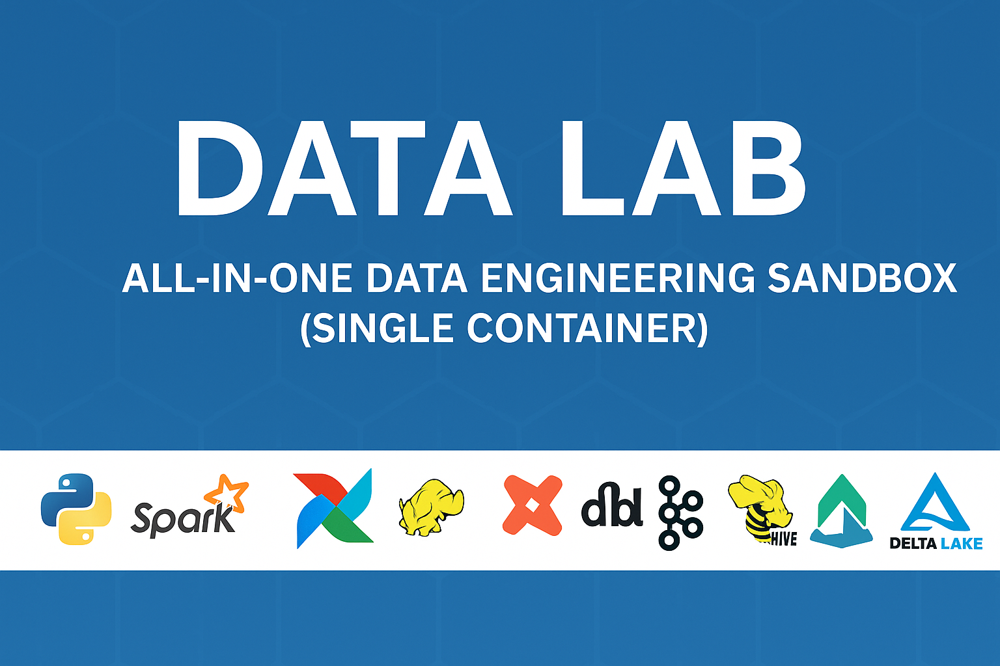
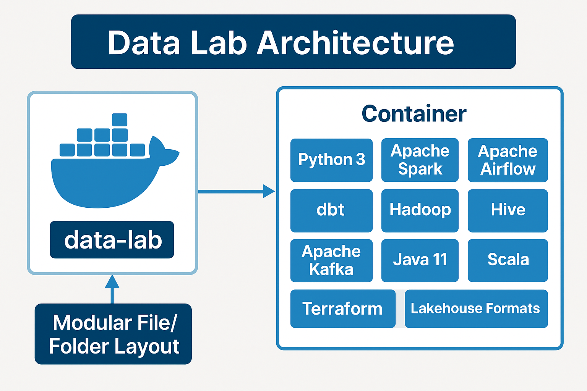

# Data Lab – All-in-One Data Engineering Sandbox (Single Container)

A production-inspired data engineering lab that runs Spark, Airflow, Hadoop, Hive, Kafka, dbt, and lakehouse formats inside one Docker container. Modular layout, helper scripts, and per-stack docs make it portfolio-ready and easy to demo.

> 🚀 Launch an end-to-end data engineering environment in minutes. Perfect for learning, prototyping, and showing your skills on GitHub.



## Project Overview

- **One container, many stacks**: all services run inside `data-lab`.
- **Modular folders**: Spark, Airflow, Hive, Hadoop, Kafka, dbt, Terraform, Hudi, Iceberg, Delta, Python, Java, Scala each have examples, configs, and READMEs.
- **Lakehouse ready**: Hudi, Iceberg, and Delta examples write to `runtime/lakehouse/`.
- **Helper UX**: `app/start`, `app/stop`, `app/restart`, `app/services_demo.sh` orchestrate everything.
- **Realistic users**: `datalab` (dev), `datalab_root` (admin), `root` share the same home for consistent paths.

## Included Tech Stacks

Each stack has its own folder, README, and example project so you can explore, extend, or showcase it.

**Core Data Engineering Frameworks**
- Apache Spark 3.5.1 — distributed compute with PySpark examples, Spark UI, history server (`spark/README.md`, `spark/example_pyspark.py`). Docs: https://spark.apache.org/docs/latest/
- Apache Hadoop 3.3.6 — HDFS, YARN, MapReduce configured with local storage (`hadoop/README.md`). Docs: https://hadoop.apache.org/docs/stable/
- Apache Hive 4.0.1 — SQL engine with Metastore + HS2, CLI wrappers, demo databases (`hive/README.md`, `hive/bootstrap_demo.sh`). Docs: https://cwiki.apache.org/confluence/display/Hive/Home
- Apache Kafka 3.7.1 — Zookeeper + broker with interactive producer/consumer demos (`kafka/README.md`, `kafka/demo.sh`). Docs: https://kafka.apache.org/documentation/

**Orchestration & Transformation**
- Apache Airflow — web UI + scheduler; DAGs live in `airflow/dags` (`airflow/README.md`). Docs: https://airflow.apache.org/docs/
- dbt Core (DuckDB) — out-of-the-box DuckDB profile; run models instantly (`dbt/README.md`, `dbt/profiles.yml`). Docs: https://docs.getdbt.com/

**Lakehouse Technologies**
- Apache Hudi 0.15.0 (`hudi/README.md`)
- Apache Iceberg 1.6.1 (`iceberg/README.md`)
- Delta Lake 3.2.0 (`delta/README.md`)
- Each includes Python examples, Spark runtime support, and isolated demo warehouses under `runtime/lakehouse/`.

**Programming Languages**
- Python 3 (`python/README.md`)
- Java 11 (`java/README.md`)
- Scala (`scala/README.md`)
- Each folder has sample programs for compile/run/integration checks.

**Infrastructure as Code**
- Terraform CLI — preconfigured demo and state layout (`terraform/README.md`). Docs: https://developer.hashicorp.com/terraform/docs

**Extended docs**
- `docs/Data-Lab-Documentation.md` for deeper background.

## Quick Start

```bash
cp .env.example .env
docker compose build
docker compose up -d

# enter the container (root shares the same home as datalab)
docker compose exec data-lab bash
su - datalab    # recommended dev user
```

Launch the service controller:

```bash
bash ~/app/start     # menu or flags: --start-airflow, --start-spark, etc.
```

Run all demos/smoke tests:

```bash
bash ~/app/services_demo.sh   # menu or flags: --run-spark-example, --run-kafka-demo, etc.
```

## User Model

- `datalab` — default dev user (recommended for day-to-day)
- `datalab_root` — elevated admin
- `root` — system root (defaults when you `docker compose exec data-lab bash`)
- All three map to `/home/datalab` (root is symlinked), so paths like `~/app`, `~/runtime`, `~/spark`, `~/airflow` are identical.

## Service Control & Demos

- **Start/stop/restart**: `bash ~/app/start`, `bash ~/app/stop`, `bash ~/app/restart` (menu or flag-driven, e.g., `--start-core`, `--stop-airflow`).
- **Demo runner**: `bash ~/app/services_demo.sh` to execute Python, Spark, dbt, Kafka, Java, Scala, Terraform, Airflow check, Hadoop/HDFS check, Hive demo, Hudi/Iceberg/Delta quickstarts.
- **Airflow login**: http://localhost:8080 (default: `datalab` / `airflow`).

## Published Ports

- `airflow-ui` 8080:8080 — Airflow webserver
- `spark-ui` 4040:4040 — Spark app UI
- `spark-master` 9090:9090 — Spark master UI
- `spark-history` 18080:18080 — Spark history server
- `kafka-broker` 9092:9092 — Kafka broker
- `hadoop-namenode` 9870:9870 — HDFS NameNode UI
- `yarn-resourcemanager` 8088:8088 — YARN RM UI
- `hiveserver2` 10000:10000 — HiveServer2 JDBC

## Runtime Storage

`runtime/` is bind-mounted to `/home/datalab/runtime` for logs, warehouses, metadata (Airflow, Spark, Hadoop, Hive, Kafka, dbt, Terraform, lakehouse demos). Remove a subfolder (e.g., `runtime/airflow`) to reset that stack; helper scripts recreate it.

## Project Structure (High-Level)



```
data-lab/
├── dev/                 # Dockerfiles (base + per-stack references)
├── app/                 # Start/stop/restart/service orchestration scripts
├── python/              # Python example + README
├── spark/               # Spark example + README
├── airflow/             # DAGs + README
├── hive/                # Hive scripts/config + README
├── hadoop/              # Hadoop scripts/config + README
├── dbt/                 # dbt project + profiles.yml + README
├── kafka/               # Kafka demos (producer/consumer/shell) + README
├── terraform/           # Terraform demo + README
├── hudi/                # Hudi example + README
├── iceberg/             # Iceberg example + README
├── delta/               # Delta Lake example + README
├── java/                # Java example + README
├── scala/               # Scala example + README
├── runtime/             # Bind-mounted state (logs, warehouses, metadata)
├── docs/                # Extended documentation
├── docker-compose.yml   # Single-container orchestration
├── .env.example         # Env defaults for Compose
└── README.md            # You are here
```

## Inside the Container (~/)

Everything mounts to `/home/datalab` (also `/root` via symlink), so paths look like:

```
~/
├── app/                 # Helper scripts: start/stop/restart/services_demo.sh
├── airflow/             # Airflow home + dags/ folder
├── dbt/                 # dbt project + profiles.yml (DuckDB)
├── delta/               # Delta Lake example
├── hadoop/              # Hadoop scripts/config
├── hive/                # Hive scripts/config; cli wrappers in app/bin
├── hudi/                # Hudi example
├── iceberg/             # Iceberg example
├── java/                # Java example
├── kafka/               # Kafka demos (producer/consumer/chat/demo.sh)
├── python/              # Python example
├── scala/               # Scala example
├── spark/               # Spark example + configs
├── terraform/           # Terraform demo
├── runtime/             # Logs/metadata/state for all stacks (airflow, spark, dbt, lakehouse, etc.)
└── app/bin/             # Convenience shims (hivecli, hivelegacy, spark-submit)
```

## System Requirements

- Docker Desktop (recent)
- 4 GB RAM minimum (8+ GB recommended)
- 8–15 GB disk space
- macOS, Linux, or Windows (WSL2 recommended)

## Perfect For

- Data engineering practice and portfolio builds
- Interview prep and live demos
- Learning Spark, Kafka, Hive, or lakehouse concepts
- Anyone wanting a “mini-production” DE environment on a laptop

---

## Reference Links

- Spark: https://spark.apache.org/docs/latest/
- Airflow: https://airflow.apache.org/docs/
- dbt: https://docs.getdbt.com/
- Hadoop: https://hadoop.apache.org/docs/stable/
- Hive: https://cwiki.apache.org/confluence/display/Hive/Home
- Kafka: https://kafka.apache.org/documentation/
- Hudi: https://hudi.apache.org/docs/
- Iceberg: https://iceberg.apache.org/docs/latest/
- Delta Lake: https://docs.delta.io/latest/
- Terraform: https://developer.hashicorp.com/terraform/docs
