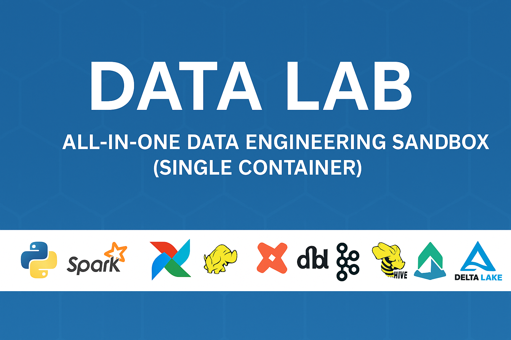

# Data Lab - All-in-One Data Engineering Sandbox

Data Lab is a single-container data engineering environment for Spark, Hadoop, Hive, Kafka, Airflow, dbt, PostgreSQL, MongoDB, Redis, and lakehouse formats (Hudi/Iceberg/Delta).



## Repository Layout
- `datalabcontainer/`: container build/runtime assets
- `stacks/`: stack examples and stack-level READMEs
- `helper/scripts/`: host-side helper scripts for build/run/copy/access
- `docs/`: architecture and detailed documentation

## Current Stack Versions
- Spark `3.5.1`
- Hadoop `3.3.6`
- Hive `2.3.9` (compatible with Spark 3.5)
- Kafka `3.7.1`
- Airflow `2.9.3`
- Hudi `0.15.0`
- Iceberg `1.6.1`
- Delta Lake `3.2.0`
- Trino `435` (embedded)
- Superset `4.1.2` (embedded)
- MinIO (embedded)

## Quick Start (Compose)
```bash
cp datalabcontainer/.env.example datalabcontainer/.env
cd datalabcontainer
docker compose build
docker compose up -d
docker compose exec data-lab bash
su - datalab
```

Service control:
```bash
datalab_app
datalab_app --start-core
```

## Quick Start (Standalone)
Linux/macOS:
```bash
NAME=datalab IMAGE=data-lab:latest ./helper/scripts/run-standalone.sh
```

Windows PowerShell:
```powershell
powershell -ExecutionPolicy Bypass -File .\helper\scripts\run-standalone.ps1 -Name datalab -Image data-lab:latest
```

## Service Endpoints
- Airflow: `http://localhost:8080/`
- Spark Master UI: `http://localhost:9090/`
- Spark History: `http://localhost:18080/`
- Spark App UI: `http://localhost:4040/`
- HDFS NameNode: `http://localhost:9870/`
- YARN ResourceManager: `http://localhost:8088/`
- HiveServer2 HTTP: `http://localhost:10001/cliservice`
- Kafka UI: `http://localhost:9002/`
- Mongo Express: `http://localhost:8083/`
- Redis Commander: `http://localhost:8084/`
- pgAdmin: `http://localhost:8181/`
- Trino: `http://localhost:8091/`
- Superset: `http://localhost:8090/`
- MinIO API: `http://localhost:9000/`
- MinIO Console: `http://localhost:9001/`

Connection endpoints:
- Spark RPC: `spark://localhost:7077`
- Hive Metastore: `thrift://localhost:9083`
- HiveServer2 Thrift: `thrift://localhost:10000`
- PostgreSQL: `postgresql://localhost:5432`
- MongoDB: `mongodb://localhost:27017`
- Redis: `redis://localhost:6379`

## Runtime Data
All mutable service state is under:
- Host: `datalabcontainer/runtime/`
- Container: `/home/datalab/runtime/`

You can reset a stack by removing only its runtime subfolder (for example `datalabcontainer/runtime/airflow`).

## Docker Optimization Notes
- `.dockerignore` excludes runtime state, helpers, docs, and local caches from build context.
- Base Dockerfile enables:
  - `PIP_NO_CACHE_DIR=1`
  - `PIP_DISABLE_PIP_VERSION_CHECK=1`
  - npm update-notifier/fund disabled
  - npm cache cleanup after global installs
- Python package installation is consolidated to reduce image layers.
- Service scripts are normalized for CRLF in entrypoint to avoid `bash\r` failures on Windows-mounted files.

## Recommended Build/Push Optimization
- Use `docker buildx` with registry cache in GitHub Actions.
- Build only on `main` (or release tags) for Docker Hub pushes.
- Use branch CI on `dev` for tests/lint only.
- Keep image tags:
  - immutable (`:sha-<commit>`)
  - rolling (`:latest`)

## References
- Trino lakehouse registration guide: `docs/TRINO-LAKEHOUSE-REGISTRATION.md`
- Hudi registration guide: `docs/HUDI-REGISTRATION.md`
- Iceberg registration guide: `docs/ICEBERG-REGISTRATION.md`
- Delta registration guide: `docs/DELTA-REGISTRATION.md`
- Spark: https://spark.apache.org/docs/latest/
- Hadoop: https://hadoop.apache.org/docs/stable/
- Hive: https://cwiki.apache.org/confluence/display/Hive/Home
- Kafka: https://kafka.apache.org/documentation/
- Airflow: https://airflow.apache.org/docs/
- dbt: https://docs.getdbt.com/
- PostgreSQL: https://www.postgresql.org/docs/
- MongoDB: https://www.mongodb.com/docs/
- Redis: https://redis.io/docs/
- Hudi: https://hudi.apache.org/docs/
- Iceberg: https://iceberg.apache.org/docs/latest/
- Delta Lake: https://docs.delta.io/latest/
